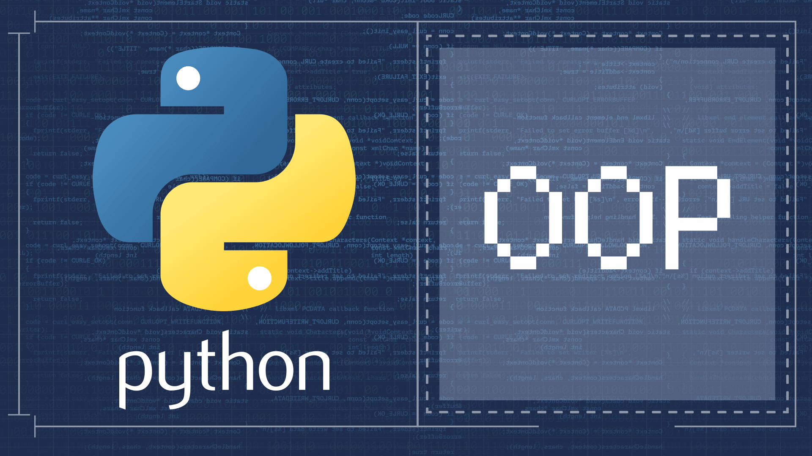

# <i>Погружение в Python
# Home work 12 - ООП - финал

# Задание: </i>

> <b>Создайте класс студента</b>:
- <i>Используя дескрипторы проверяйте ФИО на первую заглавную букву и наличие только букв.
- Названия предметов должны загружаться из файла CSV при создании экземпляра. 
- Другие предметы в экземпляре недопустимы.
- Для каждого предмета можно хранить оценки (от 2 до 5) и результаты тестов (от 0 до 100).
- Также экземпляр должен сообщать средний балл по тестам для каждого предмета и по оценкам всех предметов вместе взятых тестам 
для каждого предмета и по оценкам всех предметов вместе взятых.</i>